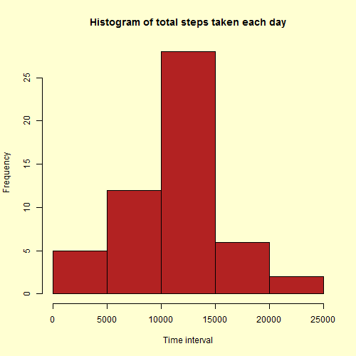
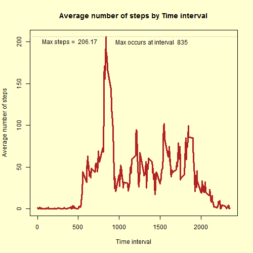
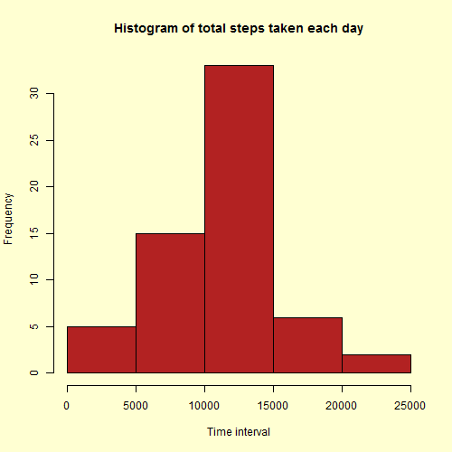
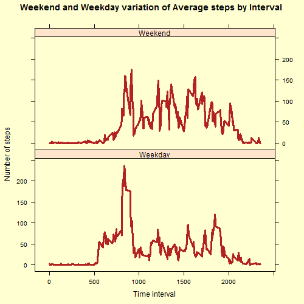

# Reproducible Research Assignment 1:
# Analysis of human movement across time of day

The following is a submission for Assignment 1 for the Reproducible Research course. The data provided contains the number of steps taken by the subjects in a 5-minute interval. The data is recorded over a 2-month period. The variables included in this dataset are:

* **steps**: Number of steps taking in a 5-minute interval (missing
    values are coded as `NA`)

* **date**: The date on which the measurement was taken in YYYY-MM-DD
    format

* **interval**: Identifier for the 5-minute interval in which
    measurement was taken

It is assumed that the data exists in a CSV file called *activity.csv* and it exists in the working directory. The following sections each contain the steps taken to analyze this data.


## A. Loading and preprocessing the data
First, the CSV data is loaded. To prepare for the analysis, it is split into 2. One contains the data where the *steps* have been recorded, and the other includes only the data where the *steps* are *NA*.


```r
ActivityMonitoringDataRaw <- read.csv(file = "activity.csv",
                                      header = TRUE,
                                      sep = ",")

ActivityMonitoringOnlyNA <- subset(x=ActivityMonitoringDataRaw, 
                                   is.na(steps)==TRUE)

ActivityMonitoringNonNA <- subset(x=ActivityMonitoringDataRaw, 
                                  is.na(steps)==FALSE)
```

For the next few sets of analyses, only the data frame without NA data will be used.

## B. What is mean total number of steps taken per day?
A summarized version of the data frame is created that groups the data by the date and creates a summarized column called *TotalSteps* that stores the sum of steps for that particular day.


```r
library(dplyr)

ActivityByDay <- ActivityMonitoringNonNA %>% 
                 group_by(date) %>% 
                 summarize(TotalSteps = sum(steps))
```

This summarized data is used to create a histogram of the steps taken each day.


```r
png(filename = "figure/plot1.png",
    width = 500, 
    height = 500, 
    units = "px", 
    pointsize = 12, 
    bg = rgb(255,255,210,maxColorValue = 255))

p <- hist(x=ActivityByDay$TotalSteps, 
          col="firebrick", 
          main="Histogram of total steps taken each day", 
          xlab="Time interval", 
          ylab="Frequency")

print(p)
dev.off()
```
 

The mean and median values for the number of steps in a day is calculated.


```r
MeanStepsPerDayWONA = mean(ActivityByDay$TotalSteps)

MedianStepsPerDayWONA = median(ActivityByDay$TotalSteps)
```

The mean value of the number of steps is **10766.19**.

The median value of the number of steps is **10765**.

## C. What is the average daily activity pattern?
To be able to analyze the daily activity pattern, the data has to be first grouped by the interval and a summary column added called *AverageSteps* which has the average number of steps for that interval across all dates.


```r
ActivityByInterval <- ActivityMonitoringNonNA %>% 
                      group_by(interval) %>% 
                      summarize(AverageSteps = mean(steps))
```

Using the data above, the maximum value for the *steps* are calculated, along with the time interval when the maximum *steps* occur.


```r
MaxSteps <- max(ActivityByInterval$AverageSteps)

MaxStepsInterval <- subset(x=ActivityByInterval, AverageSteps==MaxSteps)$interval
```

Using the summarized a time series plot is created. The maximum value is marked on the plot.


```r
png(filename = "figure/plot2.png", 
    width = 500, 
    height = 500, 
    units = "px", 
    pointsize = 12, 
    bg = rgb(255,255,210,maxColorValue = 255))

p <- plot(x=ActivityByInterval$interval, 
          y=ActivityByInterval$AverageSteps, 
          type = "l", 
          ylab = "Average number of steps", 
          xlab = "Time interval", 
          col="firebrick", 
          lwd=3)

abline(p, 
       h=MaxSteps, 
       lty=3, 
       col="grey")

title(p, 
      main="Average number of steps by Time interval")

text(p, 
     x=400, 
     y=200, 
     label=paste("Max steps = ",sprintf("%0.2f",MaxSteps)))

text(p, 
     x=1400, 
     y=200, 
     label=paste("Max occurs at interval ",MaxStepsInterval))

print(p)

dev.off()
```


## D. Imputing missing values
The focus now returns to the data where the number of steps were not calculated, marked by *NA*. In the first section, this data was split off into a separate data frame. To calculate the number of *NA* rows just calculate the number of rows in the subset data frame that contains the *NA* values.


```r
nrow(ActivityMonitoringOnlyNA)
```

The total number of NA values in the source data is **2304**.

The logic to impute values for these missing data assumes that the number of steps is a function of the day of the week and the time interval. The following is done to calculate these values. First, a column called *Weekday* is added in both the data frames, with and without the *NA* values, to store the day of the week.


```r
ActivityMonitoringOnlyNA$Weekday = weekdays(x=as.POSIXlt(ActivityMonitoringOnlyNA$date))

ActivityMonitoringNonNA$Weekday = weekdays(x=as.POSIXlt(ActivityMonitoringNonNA$date))
```

Second, the data without the NA rows is grouped by the time interval and Weekday, and a summary column is added for the average number of steps. This data now contains the average number of steps for every time and day of the week combination. 


```r
ActivityByWeekdayInterval <- ActivityMonitoringNonNA %>% 
                             group_by(interval,Weekday) %>% 
                             summarize(AverageSteps = mean(steps))
```

Lastly, the data is merged with the dataframe with the NA values. Each of the rows now have an estimated number of steps. This data frame is added onto the rows which have the steps to give a combined dataframe.


```r
ImputedData <- merge(x=ActivityMonitoringOnlyNA, 
                     y=ActivityByWeekdayInterval, 
                     by.x = c("interval", "Weekday"), 
                     by.y = c("interval", "Weekday"))

ImputedData <- ImputedData[c("AverageSteps","date","interval", "Weekday")]

names(ImputedData)[1] <- "steps"

ActivityMonitoringWithoutNA <- rbind(ActivityMonitoringNonNA, ImputedData)
```

To be able to analyze this new data, a similar process is followed as above. The data is grouped by date and a summary column is calculated with the total steps for a day.


```r
ActivityByDay <- ActivityMonitoringWithoutNA %>% 
                 group_by(date) %>% 
                 summarize(TotalSteps = sum(steps))
```

This summarized data is used to create a histogram of the steps taken each day.


```r
png(filename = "figure/plot3.png", 
    width = 500, 
    height = 500, 
    units = "px", 
    pointsize = 12, 
    bg = rgb(255,255,210,maxColorValue = 255))

hist(x=ActivityByDay$TotalSteps, 
     col="firebrick", 
     main="Histogram of total steps taken each day", 
     xlab="Time interval", 
     ylab="Frequency")

print(p)

dev.off()
```
 

With this new data, the mean and median is calculated again.


```r
MeanStepsPerDayAll = mean(ActivityByDay$TotalSteps)

MedianStepsPerDayAll = median(ActivityByDay$TotalSteps)
```
The mean value of the number of steps is **10821.21**. This deviates from the previous value by **0.5%**.
The median value of the number of steps is **1.1015 &times; 10<sup>4</sup>**. This deviates from the previous value by **2.3%**.


## E. Are there differences in activity patterns between weekdays and weekends?

To be able to analyze the difference between the number of steps during weekdays and weekends, a column has to be added that stores this fact. The code below addsa a column called When that stores such a value.


```r
ActivityMonitoringWithoutNA$When <- ifelse(test=ActivityMonitoringWithoutNA$Weekday=="Saturday"|
                                                ActivityMonitoringWithoutNA$Weekday=="Sunday",
                                           yes="Weekend",
                                           no="Weekday")
```

Next, the data is grouped by the time interval and the new column that has the values Weekday and Weekend.


```r
ActivityByInterval <- ActivityMonitoringWithoutNA %>% 
                      group_by(interval, When) %>% 
                      summarize(AverageSteps = mean(steps))
```

This data is now used to draw 2 plots, one for weekend and the other for weekdays to show the number of steps by the time interval.


```r
library(lattice)

png(filename = "figure/plot4.png", 
    width = 500, 
    height = 500, 
    units = "px", 
    pointsize = 12, 
    bg = rgb(255,255,210,maxColorValue = 255))

xyplot(AverageSteps ~ interval | When, 
       data = ActivityByInterval, 
       layout=c(1,2), 
       xlab = "Time interval", 
       ylab="Number of steps", 
       type="l", 
       col="firebrick", 
       main="Weekend and Weekday variation of Average steps by Interval", 
       lwd=3)

print(p)

dev.off()
```
 

This ends the analysis of the data. As is required of good programming, the last step of the analysis releases memory for all the objects created as part of this analysis.


```r
rm(list=ls())
```
